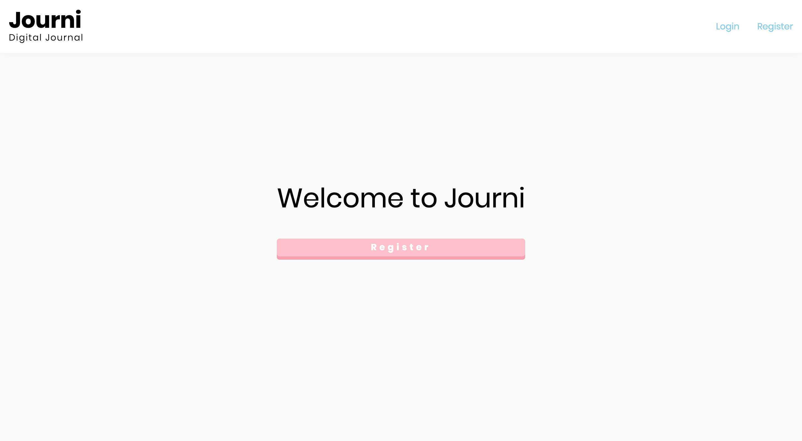
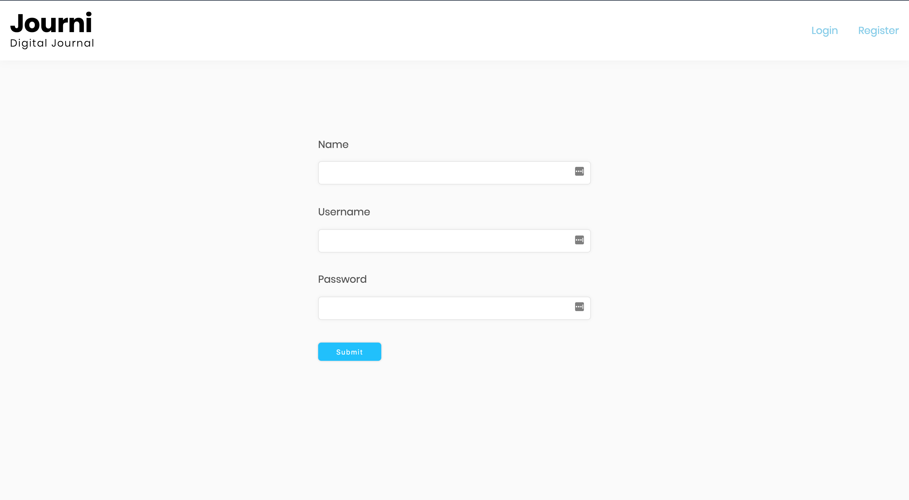

# [Journi | Digital Journal ](http://journi.netlify.com)

Welcome to Journi, a digital journalling application to store your thoughts.

## GETTING STARTED IN 4 STEPS

### STEP 1 -- REGISTER

When first visiting the website, a greeting appears with a prompt to register to the website.
On clicking the prompt, you will be redirected to the page shown above.

After filling in **all** the details, you will be redirected to a page where you can start creating your first note.

### STEP 2 -- CREATING THE NOTE

After registering or logging in you will be redirected to the above page.
Here you can fill in the title and the body of your note and submit it with the submit button.

### STEP 3 -- VIEWING THE NOTES

After creating your note, the title and body of the form are cleared for creating a new form.
Furthermore, just under the form, you will find your notes as shown above.

### STEP 4 -- EDITING AND DELETING NOTES

Editing a note is simple, all you need to do it click the edit button, and the note will highlight the areas that have been made editable. Clicking in the highlighted regions will allow to to alter that specific content. You will also notice that the edit button has been changed to a save button, which you can click to save your changes.

Deleting a note is straightforward and requires you to simply click the delete button.

